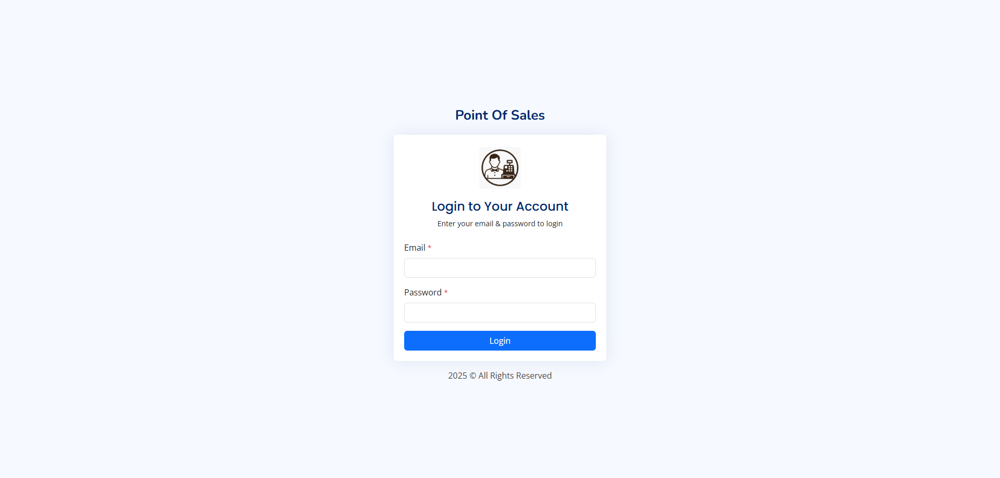
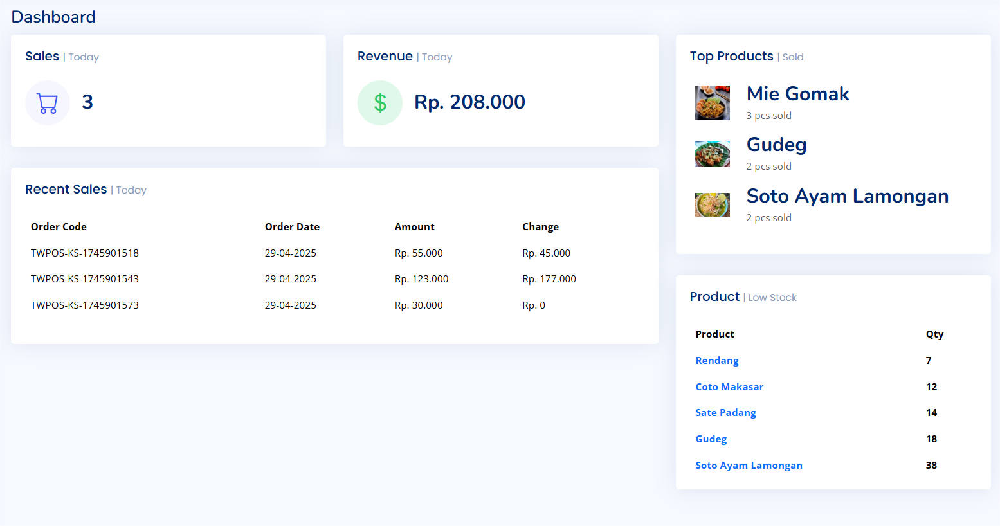
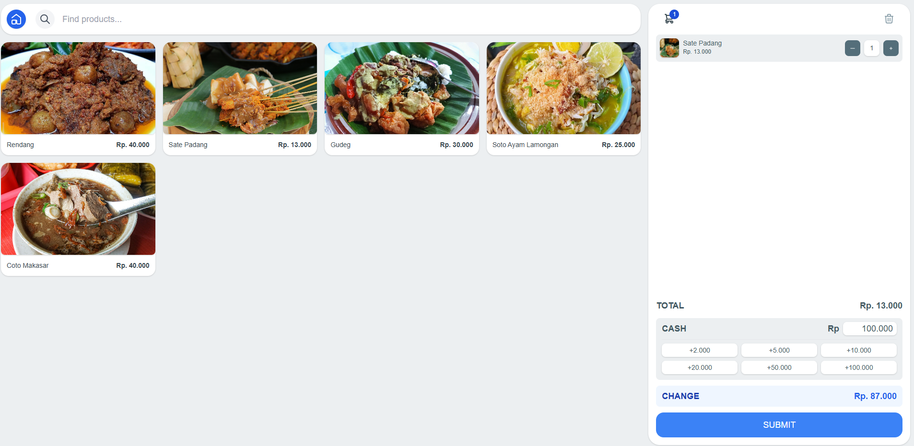
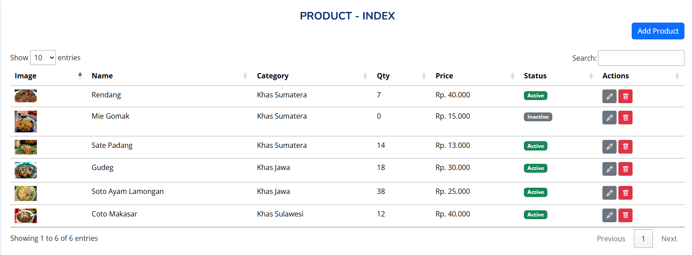
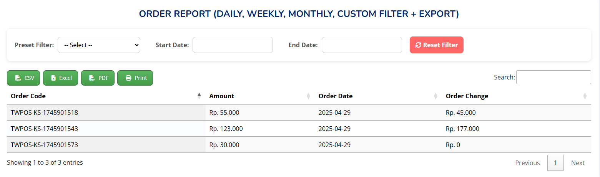

# Laravel POS

Laravel POS adalah aplikasi transaksi yang dirancang khusus untuk memenuhi kebutuhan warung makan. Aplikasi ini berfungsi sebagai kasir digital, memungkinkan pencatatan penjualan dengan cepat dan akurat. Selain itu, aplikasi ini juga dilengkapi dengan fitur manajemen produk, seperti pengelompokan menu, stok bahan baku, dan harga jual.

## Tech Stack

1. **Framework:** Laravel
2. **Styling:** Tailwind, Bootstrap
3. **Database:** MySQL

## Demo

Belum tersedia (run locally)

## Screenshots







## Run Locally

Clone the project

```bash
git clone https://github.com/tiedsandi/project_point-of-sales
```

Go to the project directory

```bash
cd project_point-of-sales
```

Install dependencies

```bash
composer install
```

Rename `.env.example` to `.env` and configure the `.env` file

```bash
cp .env.example .env
```

Run migrations

```bash
php artisan migrate
```

Seed the database

```bash
php artisan db:seed
```

Generate app key (if needed)

```bash
php artisan key:generate
```

Start the development server

```bash
php artisan serve
```

# Hi, I'm Fachran Sandi! 👋

## 🚀 About Me

Junior Developer dengan pengalaman profesional di Sinarmas Land serta berbagai proyek pribadi, termasuk mengembangkan website pribadi. Menguasai JavaScript, PHP, dan React.js, serta memiliki pemahaman di front-end maupun back-end development. Memegang sertifikasi BNSP di bidang pemrograman, siap berkontribusi dalam tim developer dan terus mempelajari teknologi baru.

## 🎓 Education

**Universitas Pembangunan Nasional Veteran Jakarta – Jakarta Selatan**
Sarjana Informatika, 3.80/4.00 (Agustus 2018 – Januari 2023)

-   Aktif sebagai anggota komite dalam berbagai kegiatan di tingkat fakultas dan universitas
-   Menjadi asisten dosen untuk mata kuliah Pengantar Basis Data pada tahun 2020

## 💼 Experience

**Sinarmas Land | PT Bumi Serpong Damai Tbk – Tanggerang**
OutSystems Developer – Kontrak (November 2023 – Agustus 2024)

-   Mengembangkan aplikasi berbasis platform low-code OutSystems dengan workflow React, untuk web dan mobile
-   Terlibat penuh dalam seluruh siklus pengembangan
-   Bertanggung jawab atas pemeliharaan aplikasi dan perbaikan bug

## 💻 Projects

-   **Aplikasi Kasir (Proyek BNSP):** Laravel, MySQL – login, manajemen produk, transaksi, laporan harian
-   **API Backend untuk Aplikasi Kasir:** Laravel, MySQL – autentikasi, validasi data, RESTful API
-   **Simple TodoList:** React.js, Redux – CRUD tugas, local storage

## 🛠 Skills

-   Bahasa: JavaScript, PHP
-   Framework & Library: React.js, Node.js, Next.js, Redux, Laravel
-   API: RESTful API, Laravel API
-   Tools: Git, MySQL, VS Code
-   Soft Skills: Problem-solving, teamwork, fast learner

## 🔗 Links

[](https://fachran-sandi.netlify.app/)
[](https://www.linkedin.com/in/fachransandi/)
